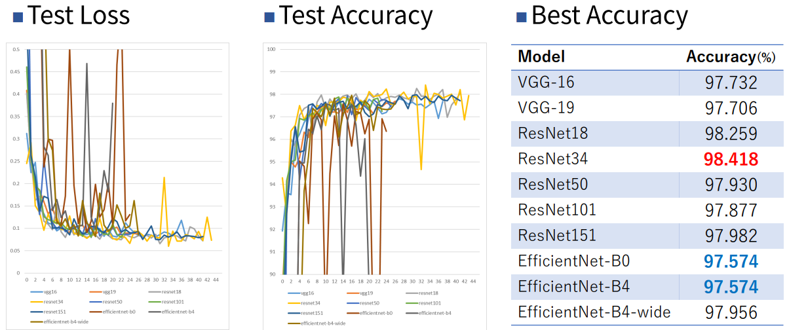

## Abstract

A Tutorial of PyTorch AutoML. It makes classification model and tune h-parameters automatically. I showed this program works well in the experiment of Google-fonts Alphabet Image classification datasets.  


## FrameWorks

- Optuna
  - To search best h-parameters with grid-search method and state of the art Bayesian optimization method.
  - https://github.com/optuna/optuna
- Hydra
  - To manage h-parameters with yaml file
  - https://github.com/facebookresearch/hydra
- ML-Flow
  - To manage and compare test results of classification model with model configs and h-parameters.
  - https://mlflow.org/


You can install all packages by using `pip` 

```bash
pip install hydra
pip insatll hydra-optuna-sweeper
pip install mlflow
```


## Setup 

1. Make PyTorch development environment. (check official site >> https://pytorch.org/)
2. check `requirements.txt` for all packages in this project.

```bash
pip insatll -r requirements.txt
```


## Start Training

- Use `train.sh` to train in default settings.

- You can use multiple GPUs in one task. Change `CUDA_VISIBLE_DEVICES` in different terminals.  
- You can set `optuna` searching options as following. 

```bash
choice(a,b)： select a number a or b. e.g.) xxx=choise(0, 1) xxx=choise([1,1], [-1,1])
range(a.b)：select a number between a to b.  e.g.) yyy=range(0, 1)  
```

## Dataset for experiments
Google fonts Dataset  
It includes a variety of alphabet character font images with labels.  
Image size is 3x224x224 but it's binary (each pixel has 0 or 255).  
  
URL：https://fonts.google.com/  
  
  
  
  
## Models
Following 10 models are automatically selected in the training sequence.
- VGG16
- VGG19
- ResNet18
- ResNet34
- ResNet50
- ResNet101
- ResNet151
- EfficientNet-B0
- EfficientNet-B4
- EfficientNet-B4-wide
  
Pre-trained model is available on PyTorch hub.  
  
  
  
## Experiment results.

  
Confusion matrix of classification result by ResNet34.

  
  
  
  
## ML-Flow results
1. Start Ml-Flow UI and open browser. (In Visual Studio Code, It automatically open default browser.)

```bash
mlflow ui
```


